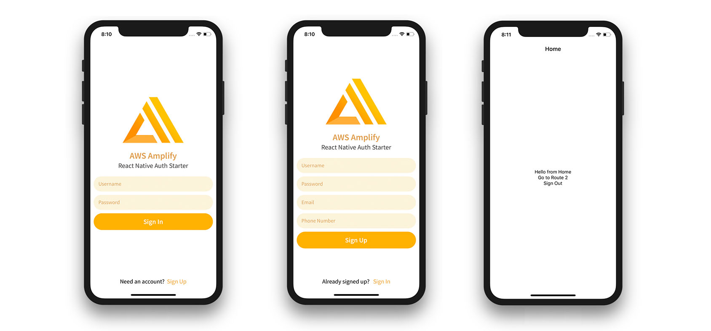
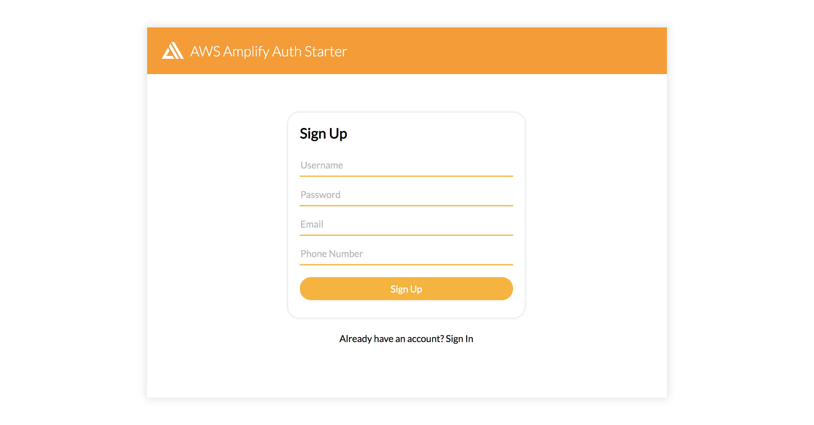

# AWS Amplify Expo Auth Starter



# AWS Amplify Expo Authentication Starter



## This project includes:    
- User sign up
- User sign in
- 2 factor authentication
- Real world auth flow using React Navigation
- Deploy to iOS, Android, and web (using Expo Web)

## Getting started  

1. Make sure you are on a new version of the AWS Amplify CLI

```sh
npm install -g @aws-amplify/cli
```

2. clone the project    

```sh
git clone https://github.com/aws-samples/aws-amplify-auth-starters.git
```

3. Check out the Expo branch

```sh
git checkout expo
```

4. install dependencies using npm or yarn    

```sh
yarn 

# or

npm i
```

5. Start project    

```sh
expo start
```

## Setting up AWS services    
If you do not have your AWS services already created, follow these steps. If you already have your services set up, just configure your aws-exports.js file.    

1. From the root of the project, initialize the Amplify project    

```sh
amplify init
```

2. Create the resources in your account

```sh
amplify push
```
